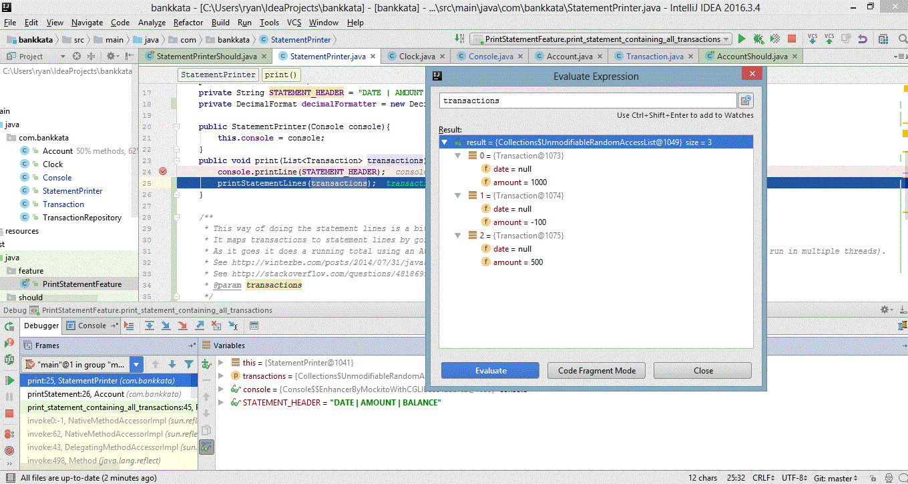

# Bank Kata to illustrate Outside-In TDD

This is the Bank Kata implemented with the aim of following Sandro Mancuso's example of Outside-in TDD from https://www.youtube.com/watch?v=XHnuMjah6ps

All credit for this should go to Mancuso and Codurance. Any mistakes are down to me.

Following the method, we start with an Acceptance Test, create stubs for any delegates/collaborators (shells with stubbed methods) and work on the acceptance test until it fails for the right reason.

## Problem Description - Bank Kata

Create a simple bank application with the following features:

- Deposit into account
- Withdraw from account
- Print a bank statement (transaction history in desc date order) to the console

## Acceptance criteria

A Statement should have the following the format:

>DATE       | AMOUNT  | BALANCE
>10/04/2014 | 500.00  | 1400.00
>02/04/2014 | -100.00 | 900.00
>01/04/2014 | 1000.00 | 1000.00

## Constraints

We have to have a class Account with the following void methods

deposit(int amount), withdraw(int amount), printStatement()

So Account is more of a service than an entity. We are not allowed to add any futher public methods to Account. We don't want to add extra getters to help us test it, we test from the outside - the side-effects.

We use Strings and integers for dates and amounts to keep things simple.

We're allowed to take liberties with whitespace in the statement (again to keep things simple).

## Movements in exercising the Kata

### First Movement - print_statement_containing_all_transactions on the PrintStatementFeature Acceptance Test

We start by creating an acceptance test. This is PrintStatementFeature.
The main thing we know is the format of the statement - it's the obvious side-effect to test for. So we start with print_statement_containing_all_transactions.

We choose to verify against console output. But how will we do this? It could be awkward with the Java console so the natural choice seems to be abstract from it with our own Console class (which might just act as an intermediary).

So Console is our first delegate. We want to stub it and Mock it in our acceptance test. Console will remain mocked in our PrintStatementFeature acceptance as Console is part of the external world as far as the print statement feature goes.

Initially Console's printLine method will throw new UnsupportedOperationException. This is because we are only going to mock that method from the Feature for now so we don't need an implementation and we don't want to implement it until we get to it.

What we do want to test without a mock in the PrintStatementFeature is the Account class, as that is meant to have the printStatement method.

The PrintStatementFeature will be failing for the right reason when it throws "Wanted but not invoked" for printLine. Naturally nothing does call printLine yet. For it to get called we're going to need to inject our Console mock somehow but we haven't decided how upfront.

Will we inject console into Account or into something else? We don't want to decide that yet. Next step is to consider how to unit test account and let the decision come out as we go along.

### Second Movement - unit testing our way into Account, deposits and withdrawals

So we need a unit test for account. We need to think about what we want account to do. It has to record debits, withdrawals and enable printing of a statement. So transactions are going to go through it.

Presumably we are going to want transactions to be managed via a repository. So to test a deposit we are going to need to check that something happens through a TransactionRepository. It's going to need some sort of deposit method.

We mock the TransactionRepository within the Account's unit test as it isn't part of the Account. The TransactionRepository will need to be injected into Account if depositing through Acccount is to invoke it.

For the PrintStatementFeature Acceptance Test we use an unmocked instance of TransactionRepository, since the Acceptance Test is testing everything internal to the system.

### Third Movement - unit testing our way into Account, printing statements

So we have a plan for handling deposits and withdrawals in TransactionRepository and we're happy Account can call to it correctly. But what about printStatement in Account?

There is a lot of formatting to be done in a statement. Would we want to have to change Account if that format were to change? Should it be Account's job to handle formatting?

We want to delegate that to a new class. We call it StatementPrinter. It will need a print method, which will give a list of transactions as a parameter. So we also want to create Transaction as a new class.

Where will the transactions to print come from? For AccountShould we want to mock retrieval of Transactions from TransactionRepository. So we add a new allTransactions method to TransactionRepository that we can mock the result of.

We also want to mock StatementPrinter, as that's a collaborator and not part of Account.

What we're testing of Account is that when we call printStatement of Account then it invokes print in StatementPrinter. For Account to call printStatement is going to need to get a StatementPrinter injected into it via constructor.

### Fourth Movement - back to PrintStatementFeature Acceptance Test - Unit test next collaborator, the TransactionRepository

So we've unit tested Account now and we can go back to the PrintStatementFeature Acceptance Test to decide what to do next. Running it shows us that we've got unimmplemented methods in the collaborators (because the AT isn't mocking like the unit tests are).

The AT gives us UnsupportedOperationException from TransactionRepository.addDeposit. It's one of the stubs that we haven't implemented yet and don't have a unit test for it yet. So next step is to create a unit test - TransactionRepositoryShould.

We want to test for what the TransactionRepository should do when addDeposit is called on it. Given that we created a (currently empty/placeholder) Transaction class, we're going to want addDeposit to create Transactions and keep record of them.

In a real application TransactionRepository would probably be going to a database and we'd probably have an Integration test (maybe using an h2 in-memory db or pointing to a designated test db). But for this kata we will treat it as a unit test and make TransactionRepositoryShould an in-memory repo.

What do we want to check of the TransactionRepository when a deposit is made? That when we invoke addDeposit then the deposit that we made is recorded. This means being able to check that the transaction recorded matches the one passed to the repo.

So we need to start to fill in what attributes will be going into Transaction by giving it a constructor signature, but initially we just stub out Transaction's constructor to throw an UnsupportedOperationException.

What will be involved in creating Transactions? Note that Transactions have a date on them. But we can't control what the current date will be as that's part of the external world. We will have to abstract that in order to mock it.

So we need a Clock abstraction but we don't have to implement it just yet. All we need is to specify the form of the method that we'll want from it for the purposes of testing TransactionRepository. That's going to be something to return a date. For now that method will just throw an UnsupportedOperationException so that we can mock the method. Today's date is going to be automatically added to deposits so we will need to inject the Clock into the TransactionRepository.

Once we've got the side-effects defined in the create_and_store_a_transaction test of TransactionRepositoryShould, then we will need to fill in Transaction. It doesn't need behaviour, just attributes. But we do need equals and hashCode implemented (auto-implemented using IDE) so that Transactions can be compared by content.

Withdrawal is then basically the same as deposit.

### Fifth Movement - Unit Testing the Clock abstraction

Clock's only function is to return today's date as a formatted string. We need to test for the formatting as we can't control what day will be produced in the implementation if we get a date from Java library, since that depends on the world.

So the side-effect to test for is the format of the date. But how do we control for testing purposes what date the clock produces?

We can do this by creating a method within the Clock that produces the date and then we can override that method within our test.

### Sixth Movement - Printing Statements, unit test StatementPrinter and then implement print

Back to the PrintStatementFeature Acceptance Test to decide what to do next again to decide what to do next. Running gives UnsupportedOperationException, this time on StatementPrinter.print. So we want to unit test StatementPrinter.

What is the side-effect of StatementPrinter doing a print? It is going to have to send something to the Console. So we're going to want to mock Console and stub at least one method to check it's invoked. But we already have a stubbed method from the AT called printLine, which is what we want.

We can test that the printing always includes a header. This should happen even if there are no transactions. So we can test for that an implement that behaviour.

We also know that the StatementPrinter should print transactions in reverse chronological order. We know how to test for this as we basically did it already in PrintStatementFeature. But this time we want to create the transactions for the test specifically, not through Account (as we're not testing Account in the StatementPrinter unit test).

How then to implement printing? We need to be able to calculate a running balance from transactions as we have to print it. One way to do a running total is by using a stream to map transactions to statement lines. This uses some quite new and unusual java features so is commented in some detail.

### Finishing touches

We can then fill in Console, which can just call System.out.println as it is only a wrapper for Java console access.

We can then re-run the PrintStatementFeature Acceptance Test. We then hit something of a mystery. The print_statement_containing_all_transactions test fails with this output:

Wanted but not invoked:
console.printLine(
    "10/04/2014 | 500.00 | 1400.00"
);

But much the same test in StatementPrinterShould passed. What could cause this? A clue comes from debugging:

No dates are getting added to the Transactions. This is because we gave explicit dates in StatementPrinterShould but are mocking the Clock in PrintStatementFeature. And we haven't told the Clock mock what to return. So we just need to do that for the test to pass.

## What is the point?

The main purpose was to illustrate the Outside-In/Mockist approach to TDD in sufficient detail that it can be used for reference. Another reason is to illustrate how design decisions get made in this approach. Note the number of design decisions made in movements 2 and 4 especially. We had to make those decisions in order to proceed and the method itself didn't show us how to make them.

For more on why this matters, see http://www.ustream.tv/recorded/86157842